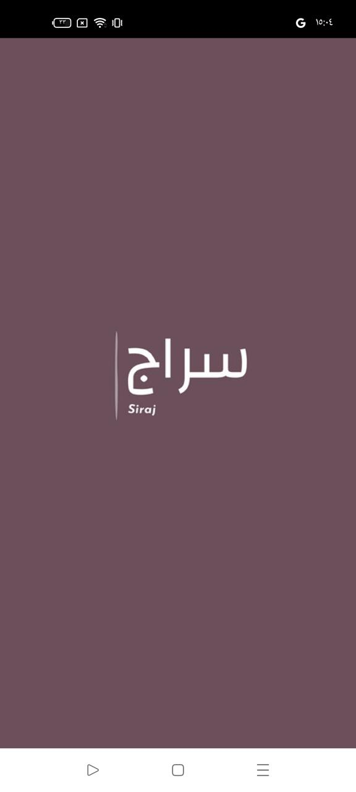
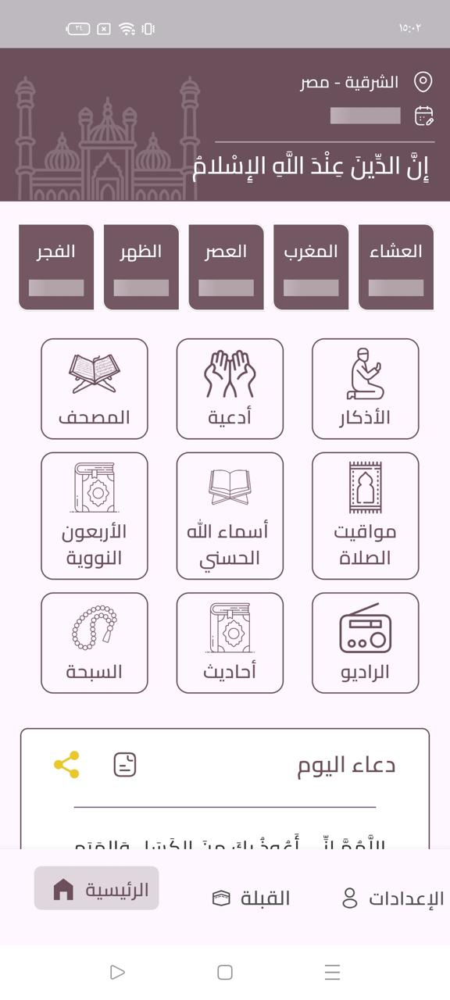
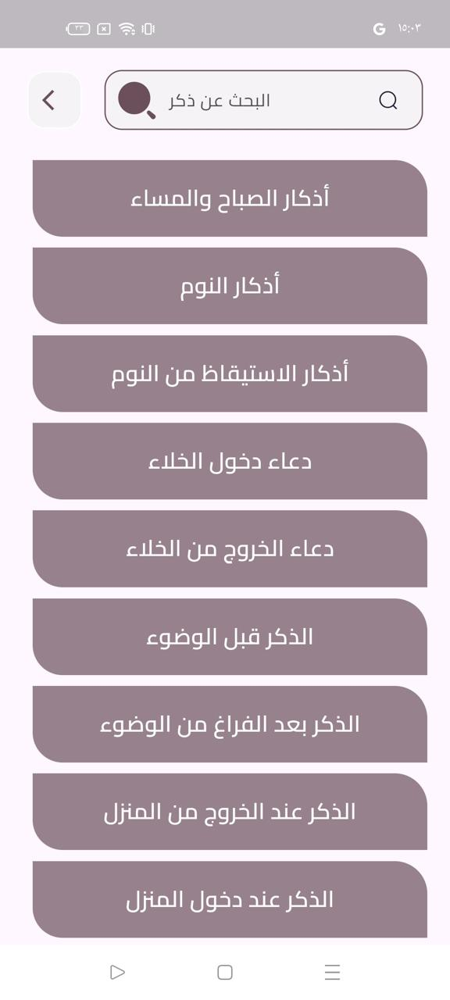
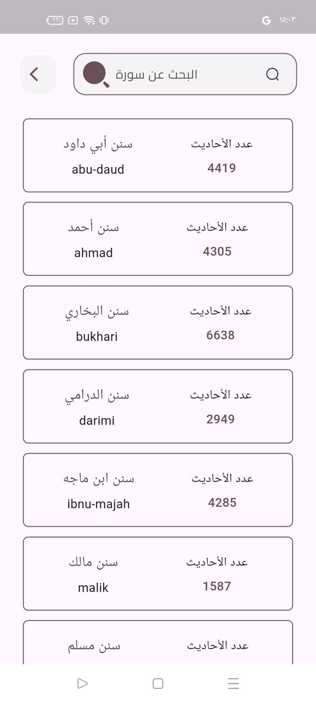
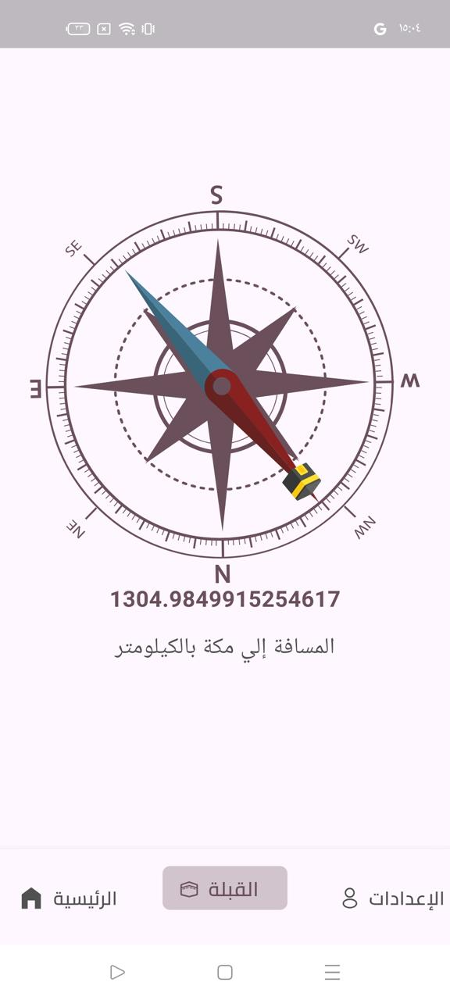
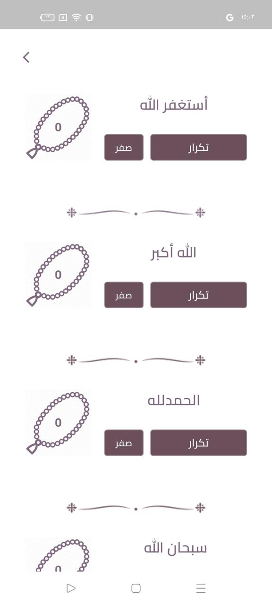
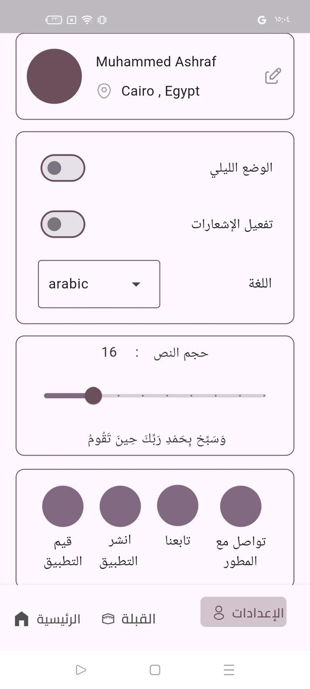

<div align="center">


# Siraj · سراج

**Your Islamic daily companion — prayer times, Quran, Hadith, Duaa, Adhkar, Qibla and Islamic radio, all in one offline‑first app.**

[](https://flutter.dev)
[](https://dart.dev)
[](https://bloclibrary.dev)
[](#getting-started)
[](#offline-first-by-design)
[](LICENSE)

</div>

---

## ✨ Overview

**Siraj** (Arabic for *lantern*) is a comprehensive Islamic daily companion built with Flutter. It brings together everything a Muslim needs throughout the day — accurate, location‑aware **prayer times with adhan notifications**, the full **Quran**, curated **Hadith collections**, a rich **Duaa & Adhkar library**, **Asmaa Allah Al‑Husna**, a **Qibla compass**, a digital **tasbih**, and a live **Islamic radio** stream — in a clean, Arabic‑first interface.

The app is **precision‑engineered for offline‑first access**: all core content (Quran index, Duaa, Adhkar, the 40 Nawawi Hadith, the 99 Names of Allah) ships inside the app as local JSON assets and is served from local storage, so Siraj works fully without connectivity. Network features (prayer timings, extended hadith books, radio) layer on top and degrade gracefully when the device is offline.

---

## 📱 Screenshots

<div align="center">

| Splash | Home | Adhkar Categories | Adhkar |
|:---:|:---:|:---:|:---:|
|  |  |  |  |

| Hadith Books | Qibla Compass | Tasbih | Settings |
|:---:|:---:|:---:|:---:|
|  |  |  |  |

</div>

---

## 🚀 Features

| | Feature | Details |
|---|---|---|
| 🕌 | **Prayer Times** | Geolocation‑aware daily & monthly timings, next‑prayer countdown on the home screen, and **adhan notifications** at each prayer. Powered by a custom prayer‑time engine integrated with the AlAdhan calculation API. |
| 📖 | **Quran** | Complete 114‑surah index with Makki/Madani classification, ayah counts, and **diacritic‑insensitive Arabic search** (type `الفاتحه` or `الْفَاتِحَة` — both work). |
| 📜 | **Hadith** | The **40 Nawawi Hadith** bundled offline, plus the nine major books — Bukhari, Muslim, Abu Dawud, Tirmidhi, Nasa'i, Ibn Majah, Ahmad, Malik, Darimi — with hadith counts, fetched on demand. |
| 🤲 | **Duaa Library** | 360+ authentic supplications, browsable and shareable. |
| 📿 | **Adhkar** | 130+ categories of morning, evening, and situational adhkar with repetition counts. |
| 🕋 | **Asmaa Allah Al‑Husna** | The 99 Names of Allah with meanings — a random name surfaces on the home screen daily. |
| 🧭 | **Qibla Compass** | Live compass needle pointing to the Kaaba, with the exact distance to Makkah in kilometres. |
| 📻 | **Islamic Radio** | Stream Quran recitations and Islamic radio stations live. |
| 🔢 | **Tasbih (Sebha)** | Digital prayer‑bead counters for Istighfar, Takbir, Tahmid and Tasbih, each with repeat/reset. |
| 🎲 | **Daily Inspiration** | Random Duaa, Zekr, and Name of Allah cards on the home screen — **copy** to clipboard or **share** to any app in one tap. |
| ⚙️ | **Settings** | Dark mode, notification toggle, Arabic/English language, adjustable Quran text size with live preview, and quick links to rate/share/follow. |
| 🌗 | **Theming** | Light / dark mode with the Cairo Arabic typeface and a calm plum palette. |
| 📶 | **Connectivity‑aware** | Real‑time internet monitoring; the UI adapts instantly when the connection drops. |

---

## 🏗️ Architecture

Siraj follows a **feature‑first Clean Architecture** with the **BLoC / Cubit** pattern for predictable, testable state management.

```
lib/
├── main.dart                     # Entry point
├── siraj.dart                    # Root widget: ScreenUtil + MultiBlocProvider + MaterialApp
│
├── core/                         # Shared, feature‑agnostic code
│   ├── controllers/              # Global cubits (theme, nav bar, internet checker)
│   ├── networking/               # Dio client + API endpoint constants
│   ├── styles/                   # Typography & font manager
│   ├── utils/
│   │   ├── constants/            # Assets, colors, routes, section definitions
│   │   ├── functions/            # Pure helper functions
│   │   └── router/               # Centralised onGenerateRoute navigation
│   └── widgets/                  # Reusable UI (buttons, text fields, nav bar, snack bars…)
│
└── features/                     # One folder per feature, each self‑contained
    ├── home/
    │   ├── controller/           # HomeCubit + states
    │   └── presentation/         # Views & widgets
    ├── quran/
    │   ├── controller/           # QuranCubit (load, search, filter)
    │   ├── data/                 # SurahModel
    │   └── presentation/
    └── other/
        └── model/                # AzkarModel, DoaaModel, AsmaaAllahModel
```

### Key design decisions

- **Offline‑first data layer** — content is loaded from bundled JSON via `rootBundle`, parsed into strongly‑typed models, and cached in memory by the owning Cubit. No network round‑trip is ever needed to read the Quran index, Duaa, Adhkar, or Hadith.
- **Single source of truth per feature** — each feature owns its Cubit, models, and UI; cross‑feature concerns (theme, connectivity, navigation) live in `core/`.
- **Centralised routing** — all routes are declared in `RoutesConstants` and resolved by a single `AppRouter.generateRoute`, keeping navigation type‑safe and discoverable.
- **Responsive by default** — `flutter_screenutil` scales every dimension from a 360×690 design baseline, so layouts look right on any phone.
- **Arabic‑aware search** — a Unicode‑range regex (`ً–ْ`) strips tashkeel before matching, so users find surahs regardless of how they type.

---

## 🛠️ Tech Stack

| Layer | Technology |
|---|---|
| Framework | [Flutter](https://flutter.dev) 3.x · Dart ≥ 3.4 |
| State management | [`flutter_bloc`](https://pub.dev/packages/flutter_bloc) (Cubit) · [`provider`](https://pub.dev/packages/provider) |
| Networking | [`dio`](https://pub.dev/packages/dio) |
| Connectivity | [`connectivity_plus`](https://pub.dev/packages/connectivity_plus) |
| Responsive UI | [`flutter_screenutil`](https://pub.dev/packages/flutter_screenutil) |
| Assets | [`flutter_svg`](https://pub.dev/packages/flutter_svg) · [`shimmer`](https://pub.dev/packages/shimmer) loading states |
| Sharing | [`share_plus`](https://pub.dev/packages/share_plus) |
| Prayer times API | [AlAdhan](https://aladhan.com/prayer-times-api) |
| Quran API | [AlQuran Cloud](https://alquran.cloud/api) |
| Hadith API | [Hadith API (gading.dev)](https://api.hadith.gading.dev) |

---

## 📶 Offline‑first by design

```
┌──────────────┐     rootBundle      ┌───────────────┐     Cubit      ┌────────────┐
│ assets/jsons │ ───────────────────▶│ Typed models  │ ─────────────▶ │     UI     │
│  (bundled)   │   zero‑latency      │ (in‑memory)   │   BlocBuilder  │            │
└──────────────┘                     └───────────────┘                └────────────┘
        ▲
        │ ships with the APK / IPA — no first‑run download, no empty states
```

| Bundled dataset | Entries |
|---|---|
| `surah.json` — Quran index | 114 surahs |
| `doaa.json` — Duaa library | 369 |
| `adhkar.json` — Adhkar categories | 132 |
| `asmaa_allah.json` — Names of Allah | 99 |
| `hadith_40.json` — 40 Nawawi Hadith | 42 |

---

## 🏁 Getting Started

### Prerequisites

- Flutter SDK **≥ 3.22** (Dart ≥ 3.4) — [install guide](https://docs.flutter.dev/get-started/install)
- Android Studio / Xcode for device tooling

### Run locally

```bash
# 1. Clone
git clone https://github.com/MuAshraf811/siraj.git
cd siraj

# 2. Install dependencies
flutter pub get

# 3. Run on a connected device or emulator
flutter run
```

### Build a release

```bash
flutter build apk --release        # Android
flutter build ios --release        # iOS (macOS + Xcode required)
```

---

## 🗺️ Roadmap

- [ ] Hijri calendar & Islamic events
- [ ] Bookmarks & last‑read position in the Quran
- [ ] Multiple adhan voices and per‑prayer notification settings
- [ ] Full English localisation of all content
- [ ] Widget / lock‑screen prayer countdown

---

## 🤝 Contributing

Contributions are welcome! Fork the repo, create a feature branch, and open a pull request.

```bash
git checkout -b feature/amazing-feature
git commit -m "feat: add amazing feature"
git push origin feature/amazing-feature
```

Please follow the existing feature‑first structure and run `flutter analyze` before submitting.

---

## 📄 License

Distributed under the MIT License. See [`LICENSE`](LICENSE) for details.

---

<div align="center">

**Built with ❤️ by [Muhammed Ashraf](https://github.com/MuAshraf811)**

*If Siraj helps you, please consider giving it a ⭐ — it helps others discover the project.*

</div>
